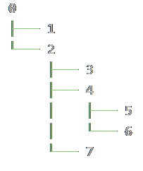
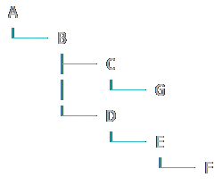

# 🐕 qq-tree

**qq-tree** is a Kotlin library that can construct a tree structure.

- Just copy and paste 🟦 Single-File version [QTreeNode.kt](src-single/QTreeNode.kt) into your project.- Or you can use 🟩 Split-File Jar version. See [Maven Dependency Section](#-split-file-jar-version-maven-dependency).
- Feel free to fork or copy to your own codebase.

## Example

### output
<p align="center">
    

</p>
<p align="center">
    
</p>
<p align="center">
    

</p>

### code

Full Source  [QTreeNodeExample.kt](src-example/QTreeNodeExample.kt)

```kotlin
// First, you have to create the root node.
val root = QTreeNode(0)

val node1 = root add 1
val node2 = root add 2
val node3 = node2 add 3
val node4 = node2 add 4
val node5 = node4 add 5
val node6 = node4 add 6
val node7 = node2 add 7

val unicodeTree = root.tree(color = QShColor.GREEN, style = QTreeStyle.UNICODE)

println(unicodeTree)

val asciiTree = root.tree(color = QShColor.BLUE, style = QTreeStyle.ASCII)

println(asciiTree)

println()

val depthFirstResult = root.descendantsList(QSearchAlgo.DepthFirst).toString()

println("DepthFirst   : $depthFirstResult") // [0, 1, 2, 3, 4, 5, 6, 7]

val breadthFirstResult = root.descendantsList(QSearchAlgo.BreadthFirst).toString()

println("BreadthFirst : $breadthFirstResult") // [0, 1, 2, 3, 4, 7, 5, 6]

println()

// node can store anything
val rootA = QTreeNode("A")
val nodeB = rootA add "B"
val nodeC = nodeB add "C"
val nodeD = nodeB add "D"
val nodeE = nodeD add "E"
val nodeF = nodeE add "F"
val nodeG = nodeC add "G"

val textTree = rootA.tree(color = QShColor.CYAN, style = QTreeStyle.UNICODE)

println(textTree)

// You can implement QLazyNode for more complicated situations.
class QFileNode(override val value: Path) : QLazyTreeNode<Path> {
    override fun hasChildNodesToFill(): Boolean {
        return value.isDirectory()
    }

    override fun fillChildNodes(): List<QFileNode> = Files.walk(value, 1).filter {
        it != value
    }.map {
        QFileNode(it)
    }.toList()

    override fun toTreeNodeString(): String {
        return value.name
    }
}

val rootDir = Paths.get("rsc-test/root-dir").toAbsolutePath()

val fileTree = QFileNode(rootDir).fillTree(maxDepth = 2).tree()

println(fileTree)
```

Please see [QTreeNodeTest.kt](src-test-split/nyab/util/QTreeNodeTest.kt) for more code examples.
Single-File version [src-test-single/QTreeNodeTest.kt](src-test-single/QTreeNodeTest.kt) is a self-contained source code that includes a runnable main function.
You can easily copy and paste it into your codebase.        

## 🟦 Single-File version Dependency

If you copy & paste [QTreeNode.kt](src-single/QTreeNode.kt).

Refer to [build.gradle.kts](build.gradle.kts) to directly check project settings.


```kotlin
dependencies {
    implementation("org.jetbrains.kotlin:kotlin-reflect:1.8.20")
    implementation("org.jetbrains.kotlin:kotlin-stdlib:1.8.20")
}
```

## 🟩 Split-File Jar version Maven Dependency

If you prefer a jar library. Add [jitpack.io](https://jitpack.io/#nyabkun/qq-tree) repository to the build script.

### build.gradle ( Groovy )
```groovy
repositories {
    ...
    maven { url 'https://jitpack.io' }
}

dependencies {
    implementation 'com.github.nyabkun:qq-tree:v2023-05-28'
}
```

### build.gradle.kts ( Kotlin )
```kotlin
repositories {
    ...
    maven("https://jitpack.io")
}

dependencies {
    implementation("com.github.nyabkun:qq-tree:v2023-05-28")
}
```

### pom.xml
```xml
<repositories>
    ...
    <repository>
        <id>jitpack.io</id>
        <url>https://jitpack.io</url>
    </repository>
</repositories>

<dependencies>
    ...
    <dependency>
        <groupId>com.github.nyabkun</groupId>
        <artifactId>qq-tree</artifactId>
        <version>v2023-05-28</version>
    </dependency>
</dependencies>
```

## How did I create this library

- This library was created using [qq-compact-lib](https://github.com/nyabkun/qq-compact-lib) to generates compact, self-contained libraries.
- It utilizes [PSI](https://plugins.jetbrains.com/docs/intellij/psi.html) to resolve function calls and class references.
- The original repository is currently being organized, and I'm gradually extracting and publishing smaller libraries.

