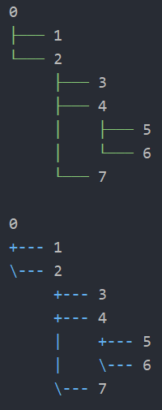
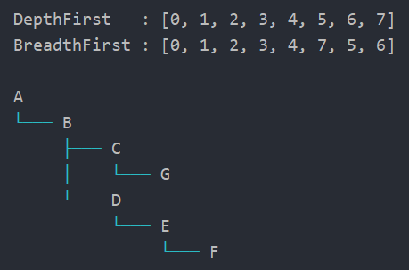
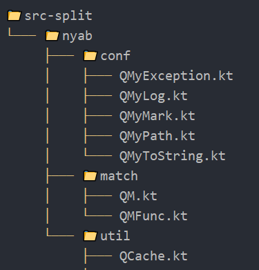

<!--- version = v2023-06-02 --->

# 🐕 qq-tree

**qq-tree** is a Kotlin library that can construct a tree structure.

## How to use
- Just copy and paste Single-File version [QTreeNode.kt](src-single/QTreeNode.kt) into your project.
- Or you can use Jar version. See [Maven Dependency Section](#jar-version-maven-dependency).
- Feel free to fork or copy to your own codebase 😍

## Example

### output
<p align="center">
    
</p>
<p align="center">
    
</p>
<p align="center">
    
</p>

### code example

Full Source : [QTreeNodeExample.kt](src-example/QTreeNodeExample.kt)

```kotlin
fun intTree() {
    // First, you have to create the root node.
    val root = QTreeNode(0)

    val node1 = root add 1
    val node2 = root add 2
    val node3 = node2 add 3
    val node4 = node2 add 4
    val node5 = node4 add 5
    val node6 = node4 add 6
    val node7 = node2 add 7

    val unicodeTree = root.tree(color = QShColor.Green, style = QTreeStyle.UNICODE)

    println(unicodeTree)

    val asciiTree = root.tree(color = QShColor.Blue, style = QTreeStyle.ASCII)

    println(asciiTree)

    println()

    val depthFirstResult = root.descendantsList(QSearchAlgo.DepthFirst).toString()

    println("DepthFirst   : $depthFirstResult") // [0, 1, 2, 3, 4, 5, 6, 7]

    val breadthFirstResult = root.descendantsList(QSearchAlgo.BreadthFirst).toString()

    println("BreadthFirst : $breadthFirstResult") // [0, 1, 2, 3, 4, 7, 5, 6]
}

fun textTree() {
    // node can store anything
    val rootA = QTreeNode("A")
    val nodeB = rootA add "B"
    val nodeC = nodeB add "C"
    val nodeD = nodeB add "D"
    val nodeE = nodeD add "E"
    val nodeF = nodeE add "F"
    val nodeG = nodeC add "G"

    val textTree = rootA.tree(color = QShColor.Cyan, style = QTreeStyle.UNICODE)

    println(textTree)
}

fun fileTree() {
    // You can implement QLazyNode for more complicated situations.
    class QFileNode(override val value: Path) : QLazyTreeNode<Path> {
        override fun hasChildNodesToFill(): Boolean {
            return value.isDirectory()
        }

        override fun fillChildNodes(): List<QFileNode> {
            return Files.walk(value, 1).asSequence().filter {
                it != value
            }.sortedBy {
                it.name
            }.sortedBy {
                !it.isDirectory()
            }.map {
                QFileNode(it)
            }.toList()
        }

        override fun toTreeNodeString(): String {
            return if (value.isDirectory()) "📁" + value.name else value.name
        }
    }

    val rootDir = Paths.get("src-split").toAbsolutePath()

    val fileTree = QFileNode(rootDir).fillTree(maxDepth = 3).tree()

    println(fileTree)
}
```

Please see [QTreeNodeTest.kt](src-test-split/nyab/util/QTreeNodeTest.kt) for more code examples.
Single-File version [src-test-single/QTreeNodeTest.kt](src-test-single/QTreeNodeTest.kt) is a self-contained source code that includes a runnable main function.
You can easily copy and paste it into your codebase.        

## Public API

- [`N.fillTree()`](src-split/nyab/util/QTreeNode.kt#L71-L110) *extension function*
- [`N.root()`](src-split/nyab/util/QTreeNode.kt#L112-L122) *extension function*
- [`N.isRoot()`](src-split/nyab/util/QTreeNode.kt#L124-L128) *extension function*
- [`N.hasCycle()`](src-split/nyab/util/QTreeNode.kt#L130-L149) *extension function*
- [`N.depth()`](src-split/nyab/util/QTreeNode.kt#L191-L207) *extension function*
- [`N.tree()`](src-split/nyab/util/QTreeNode.kt#L222-L269) *extension function*
- [`N.descendants()`](src-split/nyab/util/QTreeNode.kt#L271-L284) *extension function*
- [`N.add()`](src-split/nyab/util/QTreeNode.kt#L385-L393) *extension function*
- [`N.add()`](src-split/nyab/util/QTreeNode.kt#L395-L407) *extension function*
- [`N.add()`](src-split/nyab/util/QTreeNode.kt#L409-L415) *extension function*
- [`N.newNode()`](src-split/nyab/util/QTreeNode.kt#L417-L425) *extension function*
- [`N.ancestors()`](src-split/nyab/util/QTreeNode.kt#L427-L449) *extension function*
- [`N.descendantsList()`](src-split/nyab/util/QTreeNode.kt#L451-L458) *extension function*
- [`N.ancestorsList()`](src-split/nyab/util/QTreeNode.kt#L460-L466) *extension function*
- [`N.isLeaf`](src-split/nyab/util/QTreeNode.kt#L151-L156) *extension property*
- [`N.parent`](src-split/nyab/util/QTreeNode.kt#L158-L174) *extension property*
- [`N.children`](src-split/nyab/util/QTreeNode.kt#L176-L189) *extension property*
- [`QTreeNode`](src-split/nyab/util/QTreeNode.kt#L22-L31) *class*
- [`QLazyTreeNode`](src-split/nyab/util/QTreeNode.kt#L33-L54) *interface*
- [`QTreeNodeI`](src-split/nyab/util/QTreeNode.kt#L56-L69) *interface*
- [`QTreeStyle`](src-split/nyab/util/QTreeNode.kt#L209-L220) *enum class*
- [`QSearchAlgo`](src-split/nyab/util/QTreeNode.kt#L468-L476) *enum class*

## Single-File version Dependency

If you copy & paste [QTreeNode.kt](src-single/QTreeNode.kt),
fefer to [build.gradle.kts](build.gradle.kts) to directly check project settings.


```kotlin
dependencies {
    implementation("org.jetbrains.kotlin:kotlin-reflect:1.8.20")
    implementation("org.jetbrains.kotlin:kotlin-stdlib:1.8.20")
}
```

## Jar version Maven Dependency

If you prefer a jar library,
you can use [jitpack.io](https://jitpack.io/#nyabkun/qq-tree) repository.

### build.gradle ( Groovy )
```groovy
repositories {
    ...
    maven { url 'https://jitpack.io' }
}

dependencies {
    implementation 'com.github.nyabkun:qq-tree:v2023-06-02'
}
```

### build.gradle.kts ( Kotlin )
```kotlin
repositories {
    ...
    maven("https://jitpack.io")
}

dependencies {
    implementation("com.github.nyabkun:qq-tree:v2023-06-02")
}
```

### pom.xml
```xml
<repositories>
    ...
    <repository>
        <id>jitpack.io</id>
        <url>https://jitpack.io</url>
    </repository>
</repositories>

<dependencies>
    ...
    <dependency>
        <groupId>com.github.nyabkun</groupId>
        <artifactId>qq-tree</artifactId>
        <version>v2023-06-02</version>
    </dependency>
</dependencies>
```

## How did I create this library

- This library was created using [qq-compact-lib](https://github.com/nyabkun/qq-compact-lib) to generates a compact, self-contained library.
- **qq-compact-lib** is a Kotlin library that can extract code elements from your codebase and make a compact library.
- It utilizes [PSI](https://plugins.jetbrains.com/docs/intellij/psi.html) to resolve function calls and class references.
- The original repository is currently being organized, and I'm gradually extracting and publishing smaller libraries.

